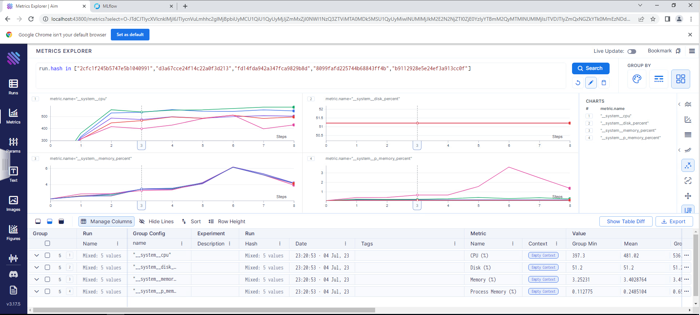
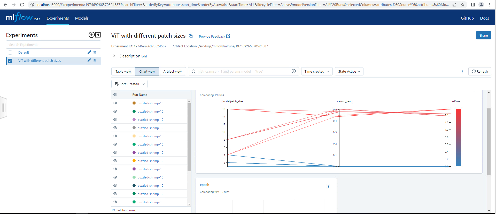

# EMLO-3_Assignment4
This repo contains session-6 assignment of EMLO course from TSAI.

## Introduction
Train ViT model on different patch_size=(1, 2, 4, 8, 16) on CIFAR10 dataset (multirun using joblib)

Do training in docker

- Make sure you mount logs directory from the host system
- Make sure to allow your Logger UI Server Port is accessible

Add DVC Tracking for your training logs, model and dataset

Update README.meLinks to an external site. on how to train your model in docker and use the logger ui
You can exec inside a running container to start the logging ui

## Folder structure
We can get started with the folder structure for this repository.

## Getting started
Lets go through the steps required to run this template:

Prerequisite:

- Docker installed on the host system.
- VS Code if using devcontainer.
- make tool installed on the host.

Steps: 
- Git clone this repo onto the host: `git clone https://github.com/devdastl/EMLO-3_Assignment6.git`
- Build docker image, this repo uses Makefile to easily execute docker command. Run command `make build-image`. you can pass `USERNAME=a PROJECT=b TAG=c` with make command to build docker image of name `a/b:c`.
 

### Run training using Makefile
To run Training with given patch size run following command:
 `make run-multitrain JOB=5 COMMAND="experiment=cifar model.patch_size=1,2,4,8,16 data.num_workers=0 logger=many_loggers"`

above command takes number of jobs `JOB` and config override `COMMAD` to execute multiple trainigs based on given parameters in `COMMAND`.

### Running visualization tools
Once the training is launched, you can track progress and logs using visualization tools like AIM and MLflow. 
Current script support both of them. Below are the steps to launch the UI.

- Open another terminal and navigate again to this repo source directory `EMLO-3_Assignment6`.
- Run Make command: `make run-visualize`. This will start AIM and MLflow UI over localhost:43800 and localhost:5000 resp.

### Visulaization tools
Below are the screenshot of tools showing 5 running process indicating trainings for different patch sizes i.e. 1,2,4,8,16.

#### AIM logger

#### MLflow logger

## Development
For development in docker run: `make run-interactive` this will allow development inside docker

