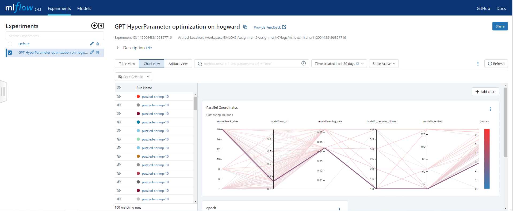

# EMLO-3_Assignment7
This repo contains session-7 assignment of EMLO course from TSAI.

## Introduction
Integrate GPT Lightning implementation to your lightning-template. Train on Harry Potter Text : https://github.com/formcept/whiteboard/tree/master/nbviewer/notebooks/data/harrypotterLinks to an external site.
 

This should satify below requirements:
- Find the Best LR and the Best Batch Size
- Perform Hyper Param Optimization (Lowest Val Loss) for
    - block_size
    - n_embed
    - n_heads
    - drop_p
    - n_decoder_blocks : This is the number of GPTDecoderBlock used in self.blocks of GPT
- DO NOT EXCEED 60M Params for the Model
- You can do MAXIMUM of 50 TRIALS
- Each HParam Optimization Experiment should be done for “1 Epoch” ONLY
- Train the final model with the best HParams for 10 Epochs. All Experiments and Training must be done on Colab using GPU (T4)

## Folder structure
We can get started with the folder structure for this repository.

## Getting started
[link of notebook](https://github.com/devdastl/EMLO-3_Assignment6/blob/assignment-7/notebooks/emlo-assignment7.ipynb)

Lets go through the steps required to run this template:

Prerequisite:

- VS Code if using devcontainer.
- make tool installed on the host.

Steps: 
- Open notebook present in [`notebooks/emlo-assignment7.ipynb`](https://github.com/devdastl/EMLO-3_Assignment6/blob/assignment-7/notebooks/emlo-assignment7.ipynb).
- Follow the notebook to install the environment and run the hparam optimization job.
- Finally run the training on 10 epochs.

### Optimial Hyper-parameters based on above notebook
In this section lets see the output of hparam search:
1. `batch_size` = 1024
2. `data.block_size` = 8 
3. `model.n_embed` = 32 
4. `model.n_heads`= 16 
5. `model.drop_p` = 0.09 
6. `model.n_decoder_blocks` = 1

- Lowest val/loss for one epoch - 4.16
- Lowest val/loss for 10 epoch - 2.8
### Running visualization tools
Once the training is launched, you can track progress and logs using visualization tools like AIM and MLflow. 
Current script support both of them. Below are the steps to launch the UI.

- Open another terminal and navigate again to this repo source directory `EMLO-3_Assignment6`.
- Run Make command: `make run-visualize`. This will start AIM and MLflow UI over localhost:43800 and localhost:5000 resp.

### Visulaization tools
Below are the screenshot of tools showing 5 running process indicating trainings for different patch sizes i.e. 1,2,4,8,16.

#### AIM logger

#### MLflow logger

## Development
For development in docker run: `make run-interactive` this will allow development inside docker

